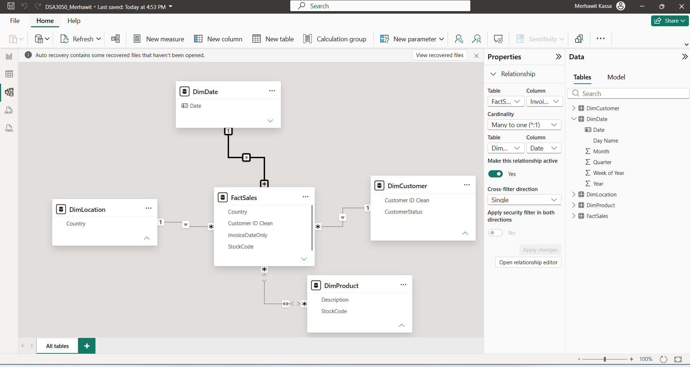

# DSA3050 – Business Intelligence & Data Visualization
## End Semester Practical Examination

**Student:** Merhawit Kassa
**Registration Number:** 670554
**Software:** Microsoft Power BI Desktop

---

## Table of Contents
- [Section A: Dataset Selection & Understanding](#section-a-dataset-selection--understanding)
- [Section B: Power Query – Data Cleaning & Transformation](#section-b-power-query--data-cleaning--transformation)
- [Section C: Data Modelling](#section-c-data-modelling)
- [Section D: DAX & Business Calculations](#section-d-dax--business-calculations)
- [Section E: Professional Power BI Dashboards](#section-e-professional-power-bi-dashboards)
- [Section F: Repository Structure](#section-f-repository-structure)

---

## Section A: Dataset Selection & Understanding

### 1. Source of the Dataset
The dataset used is the **Online Retail II** dataset, originally published on the
**UCI Machine Learning Repository** (https://archive.ics.uci.edu/dataset/502/online+retail+ii)
and also mirrored on Kaggle.

### 2. What the Dataset Represents
The dataset contains transactions from a UK-based online retailer selling all-occasion
giftware. The original source file spans December 2009 – December 2011 with **1,067,371 rows**
across 8 columns and 43 countries, 5,942 unique customers, and 5,305 unique products. Each row
represents one product line item within a customer invoice.

**Working dataset used for this project:** Given hardware constraints, the working dataset was
filtered to **calendar year 2011 only** (**499,429 rows**) to maintain smooth performance
during development in Power BI Desktop, while preserving the full range of data quality issues
(missing values, duplicates, cancellations, inconsistent formatting) and analytical complexity
required for meaningful business intelligence analysis. All figures, screenshots, and dashboard
results in this repository reflect this filtered 2011 working dataset unless otherwise stated.

### 3. Why This Dataset Was Selected
This dataset is a genuine, unaggregated transactional log containing real data quality issues:

- 243,007 missing Customer IDs (~23%)
- 4,382 missing product Descriptions
- 22,950 negative-Quantity rows (returns/adjustments)
- 6,207 zero/negative Price rows
- 19,494 cancelled invoices (prefixed "C")
- 34,335 duplicate rows
- Inconsistent country naming (EIRE, RSA, USA)

### 4. Main Variables Available
| Column | Type | Description |
|---|---|---|
| Invoice | Text | Invoice number; "C" prefix = cancellation |
| StockCode | Text | Product code |
| Description | Text | Product name |
| Quantity | Numeric | Units purchased (negative = return) |
| InvoiceDate | Date/Time | Transaction timestamp |
| Price | Numeric | Unit price (£) |
| Customer ID | ID | Customer identifier (many missing) |
| Country | Text | Customer's country |

### 5. Business/Analytical Problem
How can this online retailer better understand sales performance, customer behaviour, and
product/geographic trends to improve revenue, reduce cancellation/return losses, and identify
growth opportunities?

### 6. Analytical Questions
1. What is the overall revenue trend across the year, and are there seasonal patterns?
2. Which countries and customers generate the most revenue?
3. Which products are the best and worst performers by revenue and quantity?
4. What proportion of transactions are cancelled/returned, and where is this concentrated?
5. How does order value vary by country?
6. Are there identifiable high-value vs low-value order segments?
7. Which products are most frequently cancelled, and when do returns spike?

---

## Section B: Power Query – Data Cleaning & Transformation


*Raw dataset immediately after headers were promoted and data types set.*


*Corrected data types for InvoiceDate, Customer ID, and Price.*


*TransactionType column added to distinguish Sales from Returns.*


*PriceFlag column added to flag zero/invalid prices.*


*CustomerStatus column added to separate Registered customers from Guest/Unknown transactions.*


*Customer ID Clean column created as a reliable relationship key with no blanks.*


*Country field standardized (EIRE→Ireland, RSA→South Africa, USA→United States) using Replace Values.*


*InvoiceDateOnly custom column created (DateTime.Date([InvoiceDate])) to serve as the date relationship key with DimDate.*

### Documented Transformations

**1. Header Correction**
Problem: The first row of data was not recognized as column headers.
Transformation: Home → Use First Row as Headers.
Reason: All subsequent steps and DAX reference columns by name.
Result: All 8 columns correctly named.

**2. Data Type Correction**
Problem: Customer ID was numeric (risking incorrect aggregation); Price lacked consistent
decimal precision; InvoiceDate needed confirmation as Date/Time.
Transformation: Customer ID → Text, Price → Fixed Decimal Number, InvoiceDate → Date/Time.
Reason: Correct types are required before further cleaning and calculations.
Result: All columns analysis-ready.

**3. Duplicate Removal**
Problem: 34,335 fully duplicated rows.
Transformation: Home → Remove Rows → Remove Duplicates.
Reason: Duplicates would inflate revenue and transaction counts.
Result: Row count reduced accordingly, no duplicate transactions remain.

**4. Cancelled Flag**
Problem: Cancelled orders (Invoice prefixed "C") were not explicitly identifiable.
Transformation: Custom column `if Text.StartsWith([Invoice], "C") then "Cancelled" else "Completed"`.
Reason: Enables cancellation-rate diagnostics rather than discarding the data.
Result: Every row explicitly labeled Cancelled/Completed.

**5. TransactionType Flag**
Problem: 22,950 rows had negative Quantity (returns), mixed in with normal sales.
Transformation: Custom column `if [Quantity] < 0 then "Return" else "Sale"`.
Reason: Separates genuine sales performance from returns without discarding data.
Result: Every row labeled Sale/Return.

**6. PriceFlag**
Problem: 6,207 rows had zero/negative Price, mostly non-product administrative entries.
Transformation: Custom column `if [Price] <= 0 then "Zero/Invalid Price" else "Valid Price"`.
Reason: Prevents distortion of per-unit price and revenue KPIs.
Result: Every row explicitly flagged.

**7. Missing Description**
Problem: 4,382 rows had null Description.
Transformation: Replaced nulls with "Unknown Product" via custom column, then renamed back
to Description.
Reason: Preserves transaction volume/revenue while flagging unidentified products.
Result: No nulls remain in Description.

**8. Missing/Invalid Customer ID**
Problem: ~23-24% of rows had missing or blank Customer ID.
Transformation: Created `CustomerStatus` (`if [Customer ID] = null or Text.Trim(Text.From([Customer ID])) = "" then "Guest/Unknown" else "Registered"`) and `Customer ID Clean` (same logic, mapping to "Unknown").
Reason: Preserves all revenue data while separating registered customers from guests for
accurate customer-level KPIs.
Result: Verified via Group By — Registered: 379,980 rows, Guest/Unknown: 119,449 rows
(~23.9%), matching the original diagnostic.

**9. Country Standardization**
Problem: Inconsistent country naming — "EIRE", "RSA", "USA".
Transformation: Replace Values: EIRE→Ireland, RSA→South Africa, USA→United States.
Reason: Prevents the same country being split into multiple categories in geographic analysis.
Result: Consistent country naming across the dataset ("Unspecified" and "European Community"
were deliberately retained as-is, reflecting genuine source ambiguity).

**10. InvoiceDateOnly Key Column**
Problem: `InvoiceDate` includes a full timestamp, while the DimDate dimension table uses plain
calendar dates — these cannot be directly related without a matching key.
Transformation: Custom column `InvoiceDateOnly` using `DateTime.Date([InvoiceDate])`.
Reason: A dedicated date-only field was required to build a working relationship between
FactSales and DimDate for time-based analysis and DAX.
Result: FactSales now has a clean date-only key that correctly matches DimDate's Date column.

### Performance Note
Given the size of the full two-year source file (1M+ rows) and available hardware, the working
dataset was filtered (via Python/pandas, applied only to reduce row count — no cleaning was
performed outside Power Query) to calendar year 2011 before being loaded into Power BI, to
maintain responsive performance during development.

---

## Section C: Data Modelling


*Star schema: FactSales connected to DimProduct, DimCustomer, DimLocation, and DimDate.*

### Fact Table: FactSales
Selected as the central fact table because it contains one row per transaction line item — the
core measurable business event. Holds keys (Invoice, StockCode, Country, Customer ID Clean,
InvoiceDateOnly), measures (Quantity, Price, Revenue), and cleaning flags (Cancelled,
TransactionType, PriceFlag).

### Dimension Tables
- **DimProduct** (StockCode, Description) — supports product-level analysis.
- **DimCustomer** (Customer ID Clean, CustomerStatus) — supports customer-level KPIs.
- **DimLocation** (Country) — supports geographic analysis.
- **DimDate** (Date, Year, Quarter, MonthNumber, MonthName, DayName) — supports time-based
  analysis and was marked as the model's official Date Table.

### Relationships
| Relationship | Key | Cardinality | Filter Direction |
|---|---|---|---|
| DimProduct → FactSales | StockCode | One-to-many | Single |
| DimCustomer → FactSales | Customer ID Clean | One-to-many | Single |
| DimLocation → FactSales | Country | One-to-many | Single |
| DimDate → FactSales | Date ↔ InvoiceDateOnly | One-to-many | Single |

All relationships use single-direction cross-filtering (dimensions filter the fact table) to
avoid ambiguous filter paths.

### Modelling Challenges
1. **Missing Customer ID** — resolved via a cleaned key column (`Customer ID Clean`) replacing
   blanks with "Unknown", ensuring every row matches a valid DimCustomer record.
2. **Date/time mismatch** — `InvoiceDate` includes timestamps while DimDate uses calendar dates
   only; a dedicated `InvoiceDateOnly` column was created for the relationship key.
3. **Reference query dependencies** — dimension tables built as Power Query Reference queries
   caused cascading errors when columns were later removed from FactSales; resolved by
   retaining some descriptive columns in FactSales for traceability.
4. **Performance constraints** — the working dataset was filtered to one representative year to
   keep Power BI responsive on available hardware.

---

## Section D: DAX & Business Calculations

12 DAX measures were created across three levels of complexity.


*Level 1 – Core Measures.*


*Level 2 – Calculated Business Measures.*


*Level 3 – Advanced DAX (RANKX, SWITCH, VAR, CALCULATE, ALLSELECTED).*

### Level 1 – Core Measures
```dax
Total Revenue = SUM(FactSales[Revenue])
Total Transactions = COUNTROWS(FactSales)
Total Quantity Sold = SUM(FactSales[Quantity])
Average Order Value = DIVIDE([Total Revenue], DISTINCTCOUNT(FactSales[Invoice]), 0)
Unique Customers = DISTINCTCOUNT(FactSales[Customer ID Clean])
```

### Level 2 – Calculated Business Measures
```dax
Total Returns Revenue = CALCULATE([Total Revenue], FactSales[TransactionType] = "Return")

Cancellation Rate % =
DIVIDE(
    CALCULATE(DISTINCTCOUNT(FactSales[Invoice]), FactSales[Cancelled] = "Cancelled"),
    DISTINCTCOUNT(FactSales[Invoice]),
    0
)

Net Revenue = CALCULATE([Total Revenue], FactSales[TransactionType] = "Sale")

Revenue per Customer = DIVIDE([Total Revenue], [Unique Customers], 0)
```

### Level 3 – Advanced DAX
```dax
Product Rank by Revenue = RANKX(ALL(DimProduct[StockCode]), [Total Revenue])

Order Value Tier =
VAR CurrentAOV = [Average Order Value]
RETURN
SWITCH(
    TRUE(),
    CurrentAOV < 100, "Low",
    CurrentAOV < 500, "Medium",
    "High"
)

% of Total Revenue =
DIVIDE([Total Revenue], CALCULATE([Total Revenue], ALLSELECTED(FactSales)))
```

### Detailed Explanation of 6 Key Measures

**Total Revenue** — Sums Quantity × Price across the filtered context. The foundation KPI
underpinning all other revenue measures. Uses `SUM()`. Recalculates automatically per active
slicers/filters. Used on the Executive Overview KPI row.

**Average Order Value** — Divides total revenue by distinct invoice count for a true order-level
average rather than a misleading line-item average. Uses `DIVIDE()`, `DISTINCTCOUNT()`.
Recalculates per filter context. Used on Executive Overview and feeds `Order Value Tier`.

**Cancellation Rate %** — Proportion of unique invoices that were cancelled. Uses `CALCULATE()`
to override context and count only cancelled invoices, `DIVIDE()`, `DISTINCTCOUNT()`. Used on
the Diagnostic Analysis page, broken down by country.

**Product Rank by Revenue** — Ranks each product by revenue using `RANKX()` with `ALL()` to
clear existing filters on the product dimension so ranking stays consistent across the full
product list. Used in the Product Analysis table.

**Order Value Tier** — Classifies Average Order Value into Low/Medium/High using `VAR`/`RETURN`
and a `SWITCH(TRUE(), ...)` pattern. Converts a continuous measure into an easily-visualized
category. Used in the Product Analysis donut chart.

**% of Total Revenue** — Shows each row's share of the selected total using `DIVIDE()`,
`CALCULATE()`, and `ALLSELECTED()` (critical — without it every row would show 100%). Used in
the Product Analysis table alongside absolute revenue figures.

### Note on Time Intelligence
Classic Year-over-Year measures (`SAMEPERIODLASTYEAR`) were attempted but excluded, since the
working dataset was filtered to a single calendar year for performance, leaving no prior year
for genuine comparison. This is a deliberate, documented trade-off rather than an oversight.

---

## Section E: Professional Power BI Dashboards

Three report pages were built, moving from Overview → Detailed Analysis → Diagnostic Analysis.


*Page 1 – Executive Overview: KPI cards, revenue trend, top products, top countries by revenue,
Month and Country slicers.*


*Page 2 – Product Analysis: Top 15 products table with rank and revenue share, quantity vs
revenue scatter plot, order value tier breakdown, Country slicer.*


*Page 3 – Diagnostic Analysis: Cancellation rate and returns-revenue KPIs, cancellation rate by
country, returns revenue over time, most frequently cancelled products table,
Cancelled/Completed slicer.*

### Page 1: Executive Overview
Gives management an immediate read on performance: Total Revenue, Total Transactions, Total
Quantity Sold, Average Order Value, and Unique Customers as KPI cards; a revenue trend line
over 2011; top-performing products and countries by revenue; Month and Country slicers for
interactive filtering.

### Page 2: Product Analysis
Deep dive into product performance: a ranked table of the top 15 products by revenue (showing
Product Rank, Quantity Sold, and % of Total Revenue), a scatter plot comparing quantity sold vs
revenue to identify high-volume/low-value vs low-volume/high-value products, and a donut chart
showing the Low/Medium/High order value tier split.

### Page 3: Diagnostic Analysis
Investigates why cancellations and returns occur: headline Cancellation Rate %, Total Returns
Revenue, and Net Revenue KPIs; cancellation rate broken down by country to identify problem
regions; a returns-revenue trend line to spot seasonal spikes; and a table of the most
frequently cancelled products. A Cancelled/Completed slicer allows toggling the whole page's
context.

### Interactivity Features Used
- Slicers (Month, Country, Cancelled/Completed)
- Cross-filtering (default behaviour across all visuals on each page)
- Top N filtering for readability
- Sorted visuals (descending by key measures)
- Dynamic titles reflecting each visual's purpose

---

## Section F: Repository Structure

```
DSA3050-PowerBI-Merhawit-Kassa-670554/
│
├── README.md
│
├── data/
│   └── dataset.csv
│
├── powerbi/
│   └── DSA3050_Merhawit.pbix
│
└── screenshots/
    ├── power_query/
    │   ├── 01_raw_data.png
    │   ├── 02_data_types.png
    │   ├── 03_transaction_type_flag.png
    │   ├── 04_price_flag.png
    │   ├── 05_customer_status.png
    │   ├── 06_customer_id_clean.png
    │   ├── 07_country_standardized.png
    │   └── 08_invoicedateonly_column.png
    ├── model/
    │   └── 03_model.png
    ├── dax/
    │   ├── dax_level1_core_measures.png
    │   ├── dax_level2_business_measures.png
    │   └── dax_level3_advanced_dax.png
    └── dashboard/
        ├── 04_dashboard_overview.png
        ├── 05_dashboard_analysis.png
        └── 06_dashboard_insights.png
```

This repository documents the complete BI development process: Dataset → Power Query → Model →
DAX → Dashboard → Insights, with progressive Git commits reflecting each development stage.